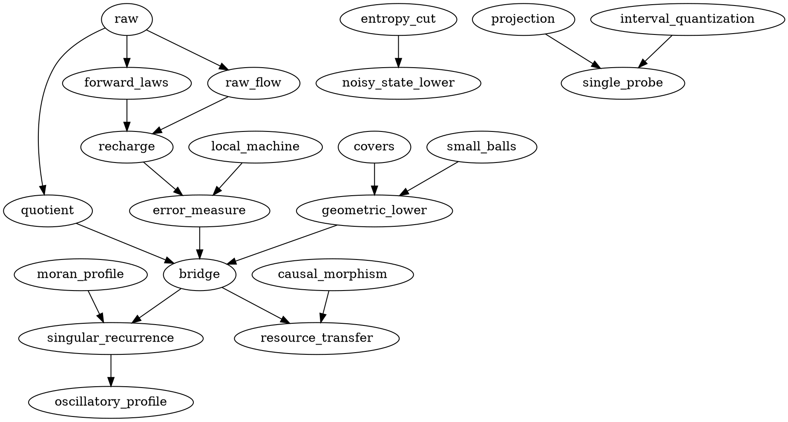

# Theorem map and dependency graph

## New central chain

Raw experiment and fixed exploration -> predictive realization / declared Borel update -> actual forward laws -> (MG) cover and small-ball profiles + executable local recurrence -> raw edge kernels A,F -> (TB) one-step measure recharge -> terminal conditional error measure -> matching checkpoint/online profile (`thm:bridge`).

`prop:recharge-flow` verifies (TB) from raw refresh and expansion flows, independently of any realization theorem. `lem:moran-profile` verifies the multiscale mass and cover data. Together they imply `thm:moran`; the oscillatory block construction gives `cor:no-dimension`. No realization is a premise of a general theorem.

The geometric lower in `thm:bridge` uses only actual conditional laws, arbitrary-center small balls and disjoint relative-scale neighborhoods. It does not use transport. The upper uses the local machine and error-measure induction. Finite-bit effectiveness is a separate hypothesis.

## Resource branches

`thm:morphism` -> common bounded-loss and full-ledger transfer.
`thm:tag` -> exact semantic total-state lower (inherited).
Fano + Gaussian entropy + retained information cut -> `thm:soft-state`.
Conditional projection + uniform interval quantization + overwrite/copy encoder -> `thm:single-probe`.
Terminal cell guessing decision gap + uniform imputation -> `prop:terminal-deficiency`.

## Inherited chain

All nineteen formal labels are listed in INHERITANCE.json and checked by verify.py. The factorization, quotient, projection, anisotropic geometry, finite-chart transfer, hold/overwrite mechanisms, crossing strata, stationary moment theorem, finite kernel corollary, suspension proposition, typed morphisms, exact tag, robust minimax and erasure witnesses, three raw realizations and initialization lemma remain in native form. The inherited stationary normalization is not silently rebranded as the new terminal-mass theorem.

